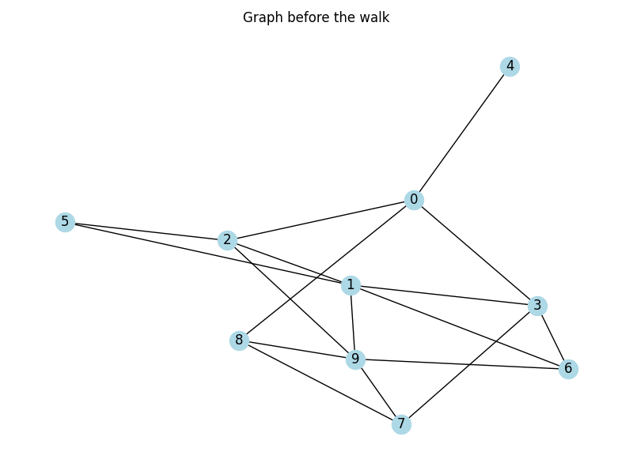
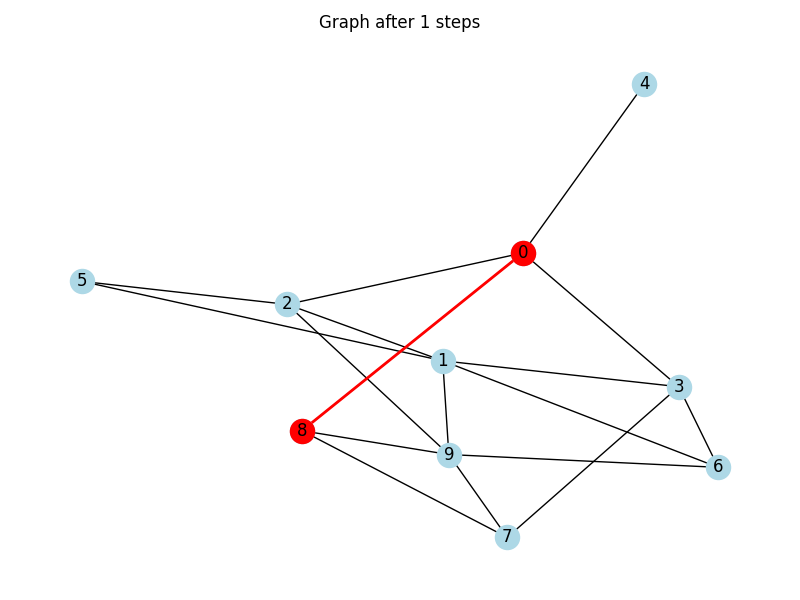
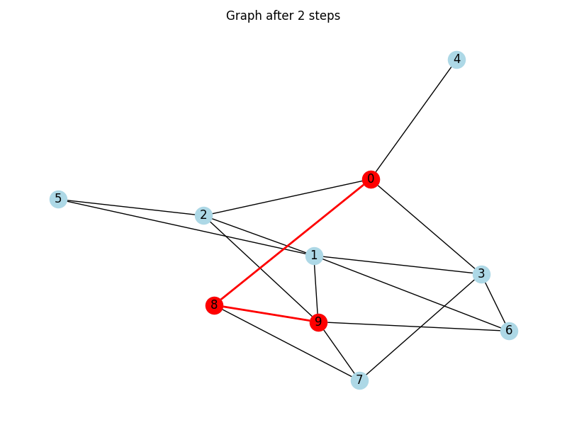
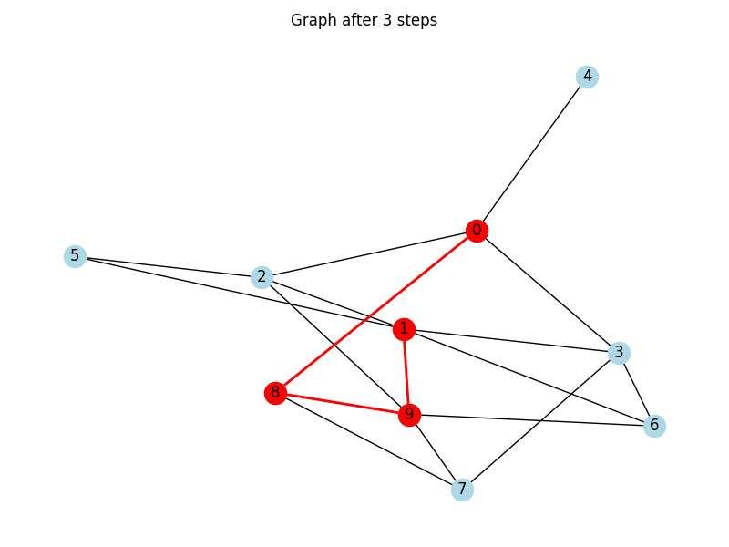
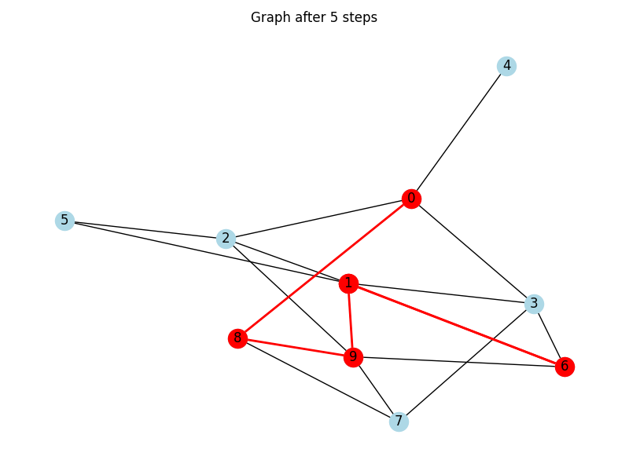
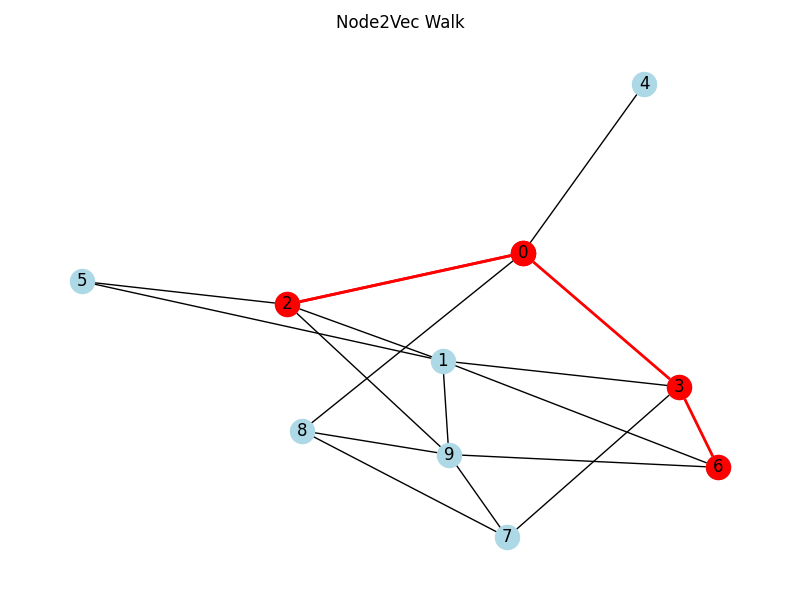

# From Uniform Walks to Node2Vec: A Guided Tour

---

## Agenda
- Random Walks in Graphs
- Uniform Random Walks
- Motivation for Biased Walks
- The Node2Vec Algorithm
- Practical Examples with `networkx`
- Summary / Key Takeaways

---

# Introduction

---

## Introduction – Why Graph Walks Matter
- Graphs model relationships (e.g., social networks, citation graphs).
- Understanding node similarity helps in tasks like recommendation.
- Graph embeddings convert nodes into vectors for ML applications.

---

# Random Walks in Graphs

---

## Random Walks in Graphs – Basics
- A walk is a sequence of nodes connected by edges.
- Random walks simulate traversal through a graph.
- They capture local and global structure.

---

# Uniform Random Walks

---

## Uniform Random Walks – Definition
- At each step, pick a neighbor uniformly at random.
- Simple and easy to implement.
- May not differentiate structural roles.

---

## Uniform Random Walks – Example Code
```python
import networkx as nx
import matplotlib.pyplot as plt
import random

G = nx.erdos_renyi_graph(10, 0.3, seed=42)
walk = [0]
for _ in range(10):
    neighbors = list(G.neighbors(walk[-1]))
    if neighbors:
        walk.append(random.choice(neighbors))

```
---

### Uniform Random Walks – Example Visualization (0)



---
### Uniform Random Walks – Example Visualization (1)


---

### Uniform Random Walks  – Example Visualization (2)


---

### Uniform Random Walks  – Example Visualization (3)


---

### Uniform Random Walks  – Example Visualization (4)


---

### Uniform Random Walks  – Example Visualization (5)


---
---

# Motivation for Biased Walks

---

## Motivation for Biased Walks – Limitations of Uniformity
- Uniform walks treat all neighbors equally.
- Cannot distinguish structural vs. homophilic similarity.
- Need for more nuanced sampling.

---

# The Node2Vec Algorithm

---

## The Node2Vec Algorithm – Key Concepts
- Introduces bias via return (p) and in-out (q) parameters.
- Balances BFS (homophily) and DFS (structural equivalence).
- Generates node sequences like sentences for embedding.

---

## Node2Vec – Transition Probabilities
- Biased probabilities guide the walk.
- Use previous node to decide transition bias.
- Formula uses edge weights, p, and q.


---

## Practical Examples – Node2Vec Walk
```python
node2vec = Node2Vec(G, dimensions=64, walk_length=5, num_walks=1, p=0.5, q=2, seed=42)
walks = node2vec.walks
walk = [int(n) for n in walks[0]]
fig, ax = plt.subplots(figsize=(8, 6))
pos = nx.spring_layout(G, seed=42)
nx.draw(G, pos, with_labels=True, node_color="lightblue", ax=ax)
nx.draw_networkx_nodes(G, pos, nodelist=walk, node_color="red", ax=ax)
nx.draw_networkx_edges(
    G, pos, edgelist=list(zip(walk[:-1], walk[1:])), edge_color="red", width=2, ax=ax
)
```

---
### Node2Vec – Example Visualization


---

## Node2Vec – From Walks to Vectors
- Each node generates many random walks (sequences).
- Walks are treated like **sentences**, and nodes like **words**.
- We learn embeddings by predicting a node's **neighbors in the walk**.
- This approach is inspired by **natural language processing (NLP)** techniques.

---

## What is Word2Vec? (Simplified)
- Word2Vec is an algorithm from NLP.
- It learns word meanings by analyzing which words appear nearby.
- "You shall know a word by the company it keeps."
- Similar words often appear in similar contexts.

---

## How Word2Vec Works
- It takes a large set of sentences (e.g., news articles).
- For each word, it defines a **window** (e.g., 2 words before and after).
- Trains a neural network to **predict context words** from the center word.
- Result: every word gets mapped to a **vector in space**.

---

## Node2Vec – Skip-Gram Analogy
```
Walk:        A → B → C → D → E
Context:         [B, D]
Input:               C
```
- Input = center node (`C`)
- Context = neighboring nodes in walk window (e.g., `[B, D]`)
- Objective: Predict context nodes from input node.
- Same training idea as Word2Vec, but on graph walks instead of text.

---

# Summary / Key Takeaways

---

## Summary / Key Takeaways
- Uniform walks are foundational but limited.
- Node2Vec introduces flexible, biased sampling.
- Visualizing helps to understand walk behavior.
- Embeddings derived from walks empower ML on graphs.
