# From Uniform Walks to Node2Vec: A Guided Tour

---

## Agenda
- **Background: Word2Vec** — how words become vectors
- Random Walks in Graphs
- Uniform Random Walks
- Motivation for Biased Walks
- The Node2Vec Algorithm
- Practical Examples with `networkx`
- Summary / Key Takeaways

---

# Introduction

---

## Introduction – Why Graph Walks Matter
- Graphs model relationships (e.g., social networks, citation graphs).
- Understanding node similarity helps in tasks like recommendation.
- Graph embeddings convert nodes into vectors for ML applications.
- **But first:** the trick all of this is built on comes from *language*.

---

# Background: How Word2Vec Turns Words into Vectors

---

## A single number means nothing on its own
- In a spreadsheet, what does the value **`3`** mean?
- **3 bedrooms?  3rd floor?  3 dollars?**
- You can't tell — until you know **which column** it sits in.

---

## Meaning = value + context
| In a… | one unit is… | …and gets its meaning from |
|---|---|---|
| **table** | a value | its **column** |
| **graph** | a node | its **neighbours** |
| **text** | a word | the **words around it** |

- The same idea runs through all three: **context is everything.**

---

## Tables hand you context for free — graphs and text don't
- A spreadsheet *gives* you labelled columns.
- A **node** has no columns — only **neighbours**.
- A **word** has no columns — only the **words beside it**.
- So for graphs and text we must **build** a representation that captures that context.

---

## In Chapter 7 we built that context by hand
- For each node we *invented* columns: degree, clustering, centralities…
- That is the tabular trick — but **we** had to choose every feature.
- This chapter does it automatically: **let the data reveal each node's context.**

---

## NLP cracked this first — for words
- The breakthrough was **Word2Vec** (Mikolov et al., 2013).
- It turns each **word** into a vector that encodes its context.
- **Node2Vec is the very same trick on graphs** — so we learn Word2Vec first.

---

## The principle: meaning comes from context
> *"You shall know a word by the company it keeps."* — J. R. Firth, 1957

- *"I poured a glass of \_\_\_\_"* → **milk, water, juice** — never *democracy*.
- Words in similar contexts mean similar things → they should get **similar vectors**.

---

## The goal: one vector per word
- Give every word a short list of numbers — its **embedding**.
- Rule of a good embedding: **similar words → nearby vectors**.
- "Similar" means **appearing in similar contexts**.

---

## A word's context = a window around it
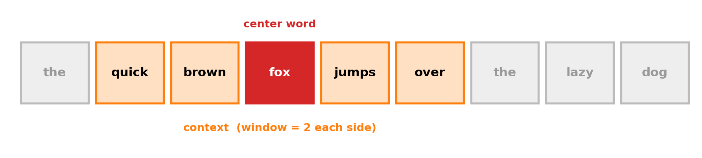

---

## Slide the window → make training data
- Move the window over **every** position in a huge text corpus.
- Each window gives **(center, context)** pairs — the only data we use.
- No labels, no dictionaries: just raw sentences.

---

## One window → several training pairs
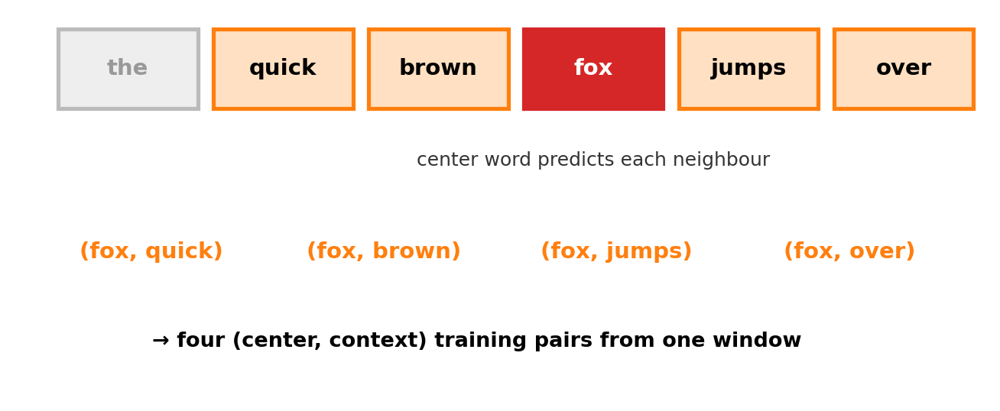

---

## But a network can't read the word "fox"
- A neural net needs **numbers**, not strings.
- The obvious first encoding: **one-hot** —
  a vector as long as the vocabulary, all `0` except a single `1`.

---

## Attempt 1: the one-hot vector
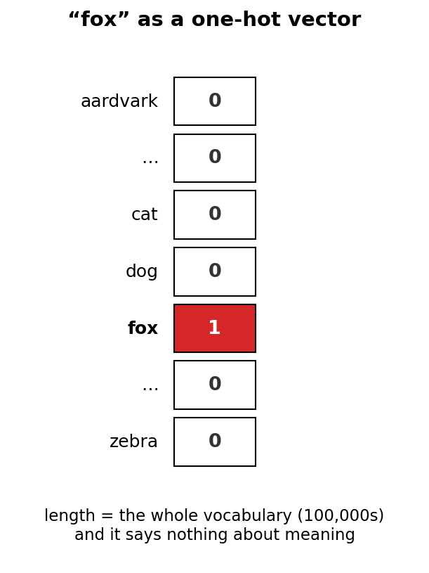

---

## Why one-hot is a poor representation

<div class="columns">
<div>


</div>
<div>

- **Huge:** length = vocabulary size — easily **100,000+** numbers per word.
- **Sparse:** all zeros but a single one — almost no information.
- **No similarity:** every word is the *same* distance from every other — "cat" is no closer to "dog" than to "democracy".

</div>
</div>

---

## What we want instead: small and dense
- Squeeze each word into ~**50–300** numbers, all non-zero.
- This is **dimensionality reduction**:
  a 100,000-long *sparse* vector → a short *dense* one.
- And unlike one-hot, the short vector can place **similar words close**.

---

## The embedding is just a lookup table
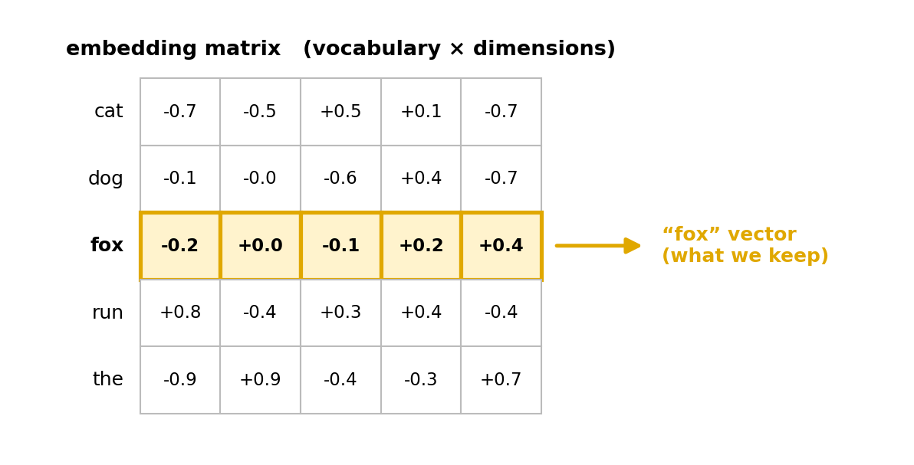

---

## So the real question is…
- The embedding matrix starts as **random numbers**.
- **How do we fill it in** so the geometry becomes meaningful?
- Answer: train it to do **one job — predict context**.

---

## Skip-gram: the whole network
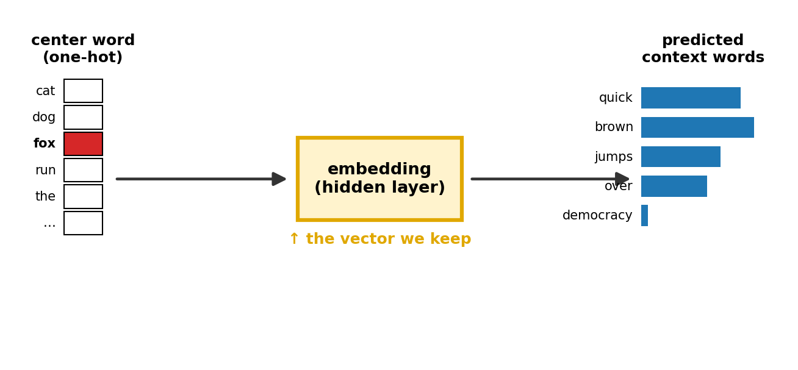

---

## What skip-gram does, step by step
- **Input:** the center word's one-hot vector.
- **Hidden layer:** look up its row → the word's current vector.
- **Output:** a score for *every* word = "are you my neighbour?"
- A **softmax** turns those scores into probabilities.

---

## How it learns
- Compare the predicted neighbours with the **true** context words.
- Nudge the vectors a little to make the truth more likely (**gradient descent**).
- Repeat over **millions** of windows — the vectors slowly self-organize.

---

## Why similar words end up close
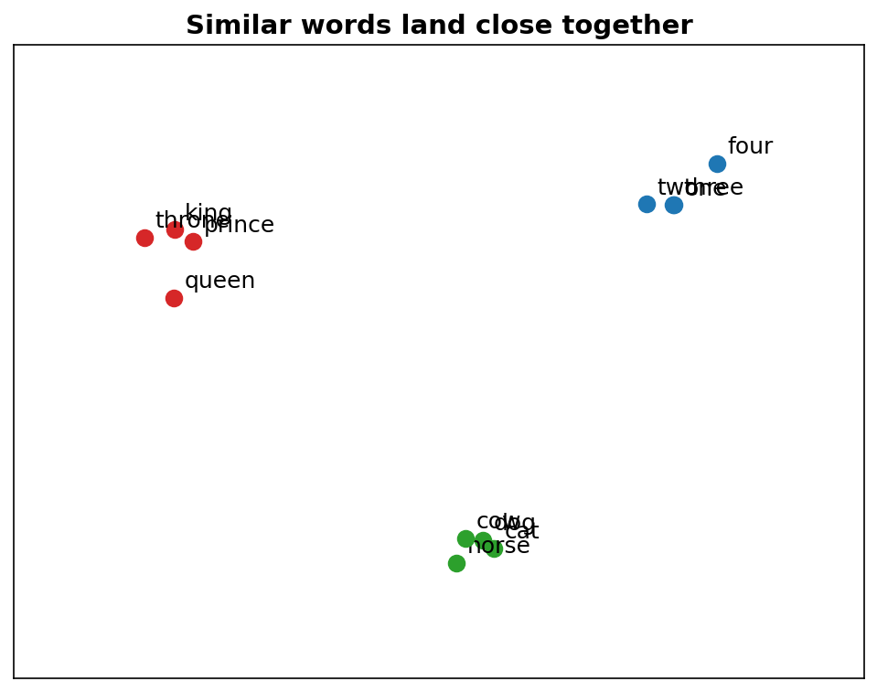

---

## The numbers are opaque — the geometry is not
- A single value, say `dim 4 = -0.2`, means **nothing** on its own.
- There is no "royalty column" you can read off.
- Meaning lives in the **whole vector** — in **distances and directions**,
  never in any one number.

---

## The payoff: meaning becomes arithmetic
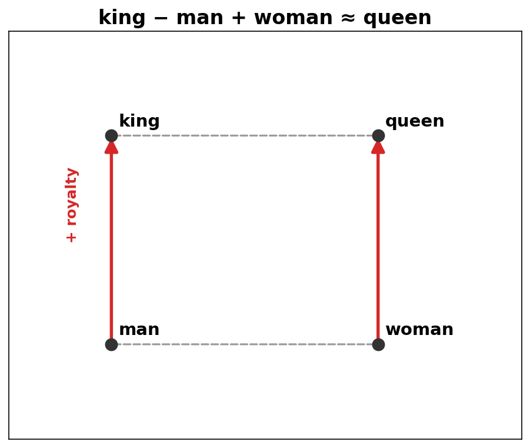

---

## Seeing embeddings: a second reduction
- The vectors are still ~100-dimensional — we can't look at them directly.
- To *visualize*, reduce **again** to **2-D** with **PCA** or **t-SNE**.
- (Exactly what we do to the *node* embeddings in the notebook.)

---

## Word2Vec in one slide
- **In:** raw sentences → **(center, nearby)** pairs from a sliding window.
- **Encode:** one-hot in → look up a small **dense** vector.
- **Train:** predict the neighbours; nudge each vector (*skip-gram*).
- **Out:** similar words → similar vectors; directions carry meaning.
- Keep this picture — graphs use the **exact same machine** 👇

---

# Random Walks in Graphs

---

## Random Walks in Graphs – Basics
- A walk is a sequence of nodes connected by edges.
- Random walks simulate traversal through a graph.
- They capture local and global structure.

---

# Uniform Random Walks

---

## Uniform Random Walks – Definition
- At each step, pick a neighbor uniformly at random.
- Simple and easy to implement.
- May not differentiate structural roles.

---

## Uniform Random Walks – Example Code
```python
import networkx as nx
import matplotlib.pyplot as plt
import random

G = nx.erdos_renyi_graph(10, 0.3, seed=42)
walk = [0]
for _ in range(10):
    neighbors = list(G.neighbors(walk[-1]))
    if neighbors:
        walk.append(random.choice(neighbors))

```
---

### Uniform Random Walks – Example Visualization (0)
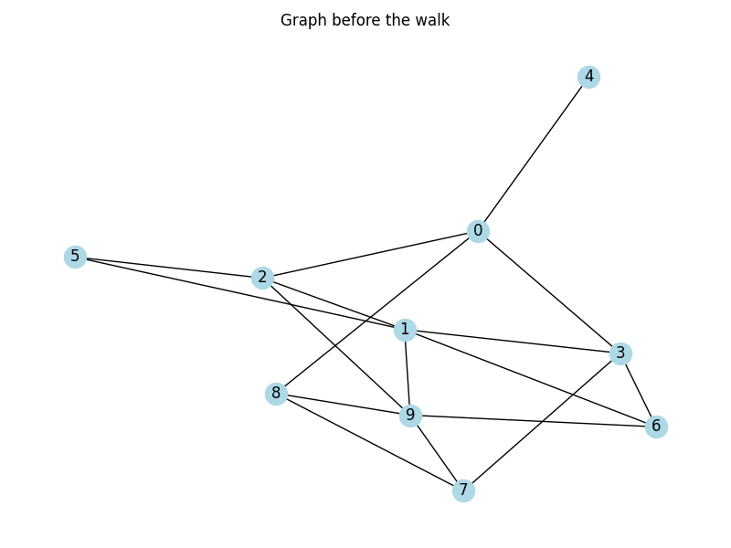


---
### Uniform Random Walks – Example Visualization (1)
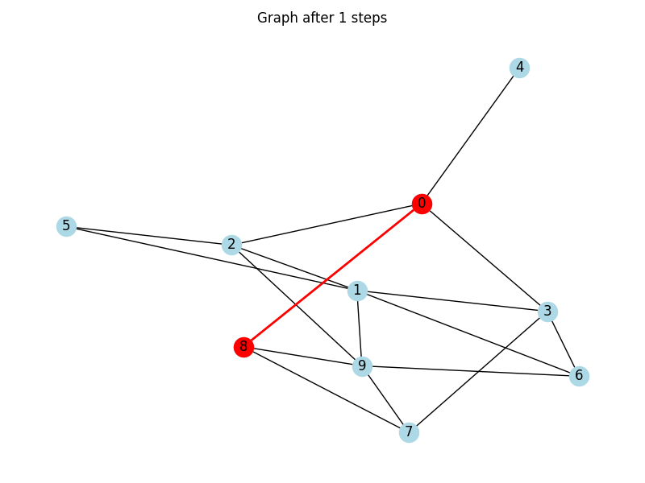

---

### Uniform Random Walks  – Example Visualization (2)
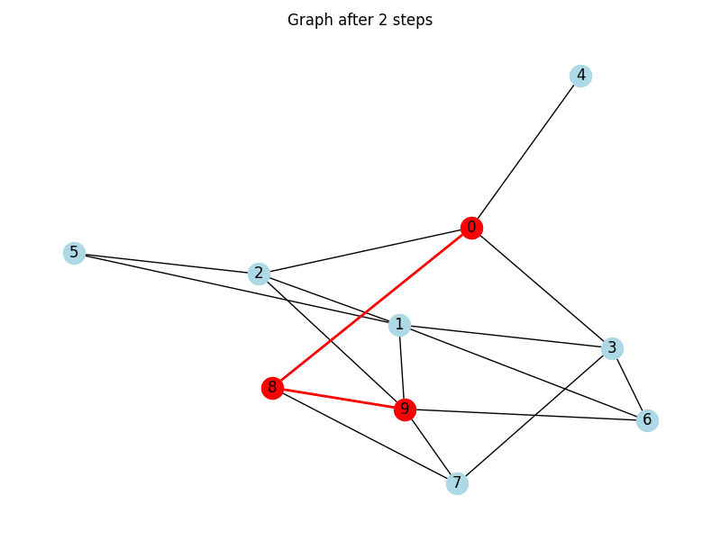

---

### Uniform Random Walks  – Example Visualization (3)
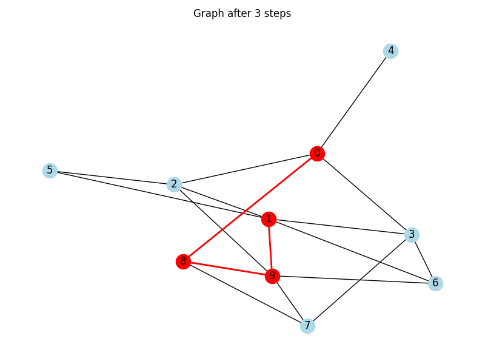

---

### Uniform Random Walks  – Example Visualization (4)


---

### Uniform Random Walks  – Example Visualization (5)
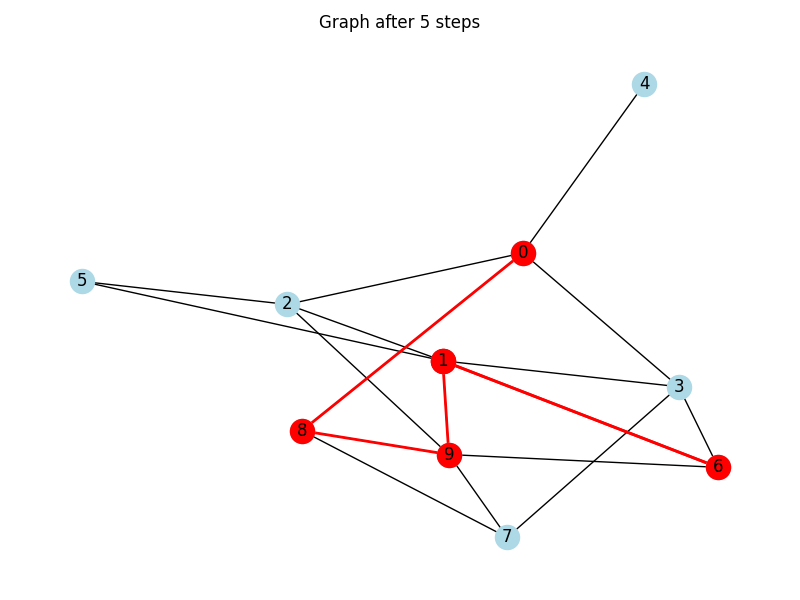

---

# Motivation for Biased Walks

---

## Motivation for Biased Walks – Limitations of Uniformity
- Uniform walks treat every neighbour equally.
- So they **blur two very different kinds of similarity** — see next.
- We need a walk we can *steer*.

---

## Two kinds of node similarity
- Nodes can be "alike" in **two very different ways**:
- **Homophily** — they sit in the **same community** ("same crowd").
- **Structural** — they play the **same role**, even if far apart ("same job").

---

## Homophily — "same crowd"

<div class="columns">
<div>

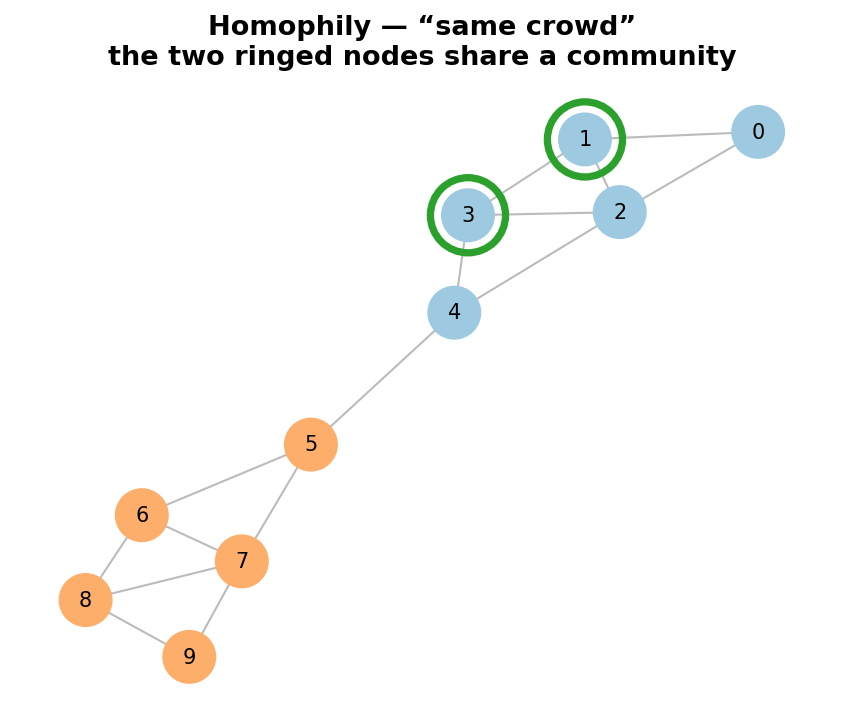

</div>
<div>

- The two ringed nodes share **most of their neighbours**.
- They live in the **same community**.
- Homophily: *embed them close together.*

</div>
</div>

---

## Structural similarity — "same job"

<div class="columns">
<div>

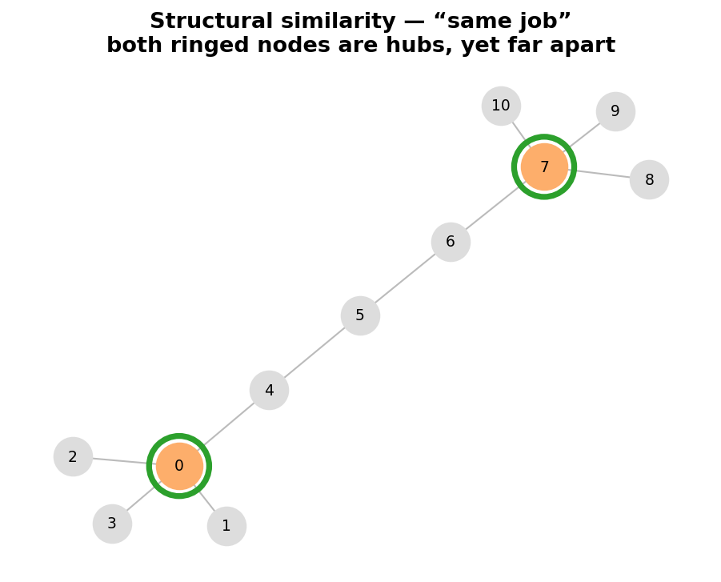

</div>
<div>

- The ringed nodes are in **different regions**, far apart.
- Yet both are **hubs** — the centre of a star.
- Structural: *same role → embed them close.*

</div>
</div>

---

## BFS and DFS each capture one kind

<div class="columns">
<div>

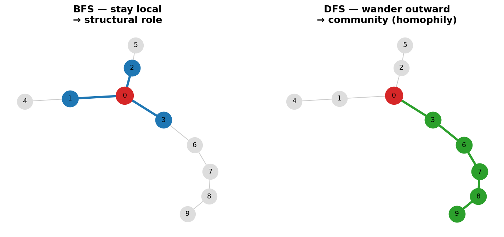

</div>
<div>

- **BFS** stays local → maps a node's **immediate surroundings** → **structural role**.
- **DFS** wanders out → sweeps the **wider community** → **homophily**.

</div>
</div>

---

# The Node2Vec Algorithm

---

## Node2Vec = a *steerable* random walk
- Same skip-gram engine as DeepWalk — only the **walk** changes.
- Two knobs bias every step: **return `p`** and **in-out `q`**.
- They tilt the walk toward **BFS** (→ structural) or **DFS** (→ homophily).

---

## How the next step is biased

<div class="columns">
<div>

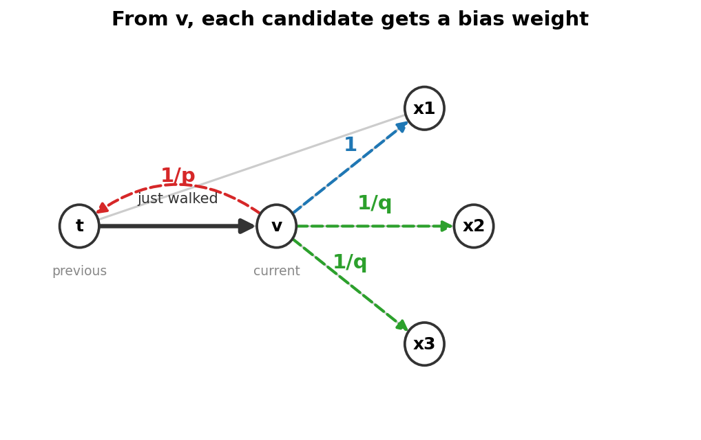

</div>
<div>

Just stepped **t → v**. Each candidate gets an *unnormalised weight*:
- back to **t**: **1/p**
- to a neighbour of t (stays close): **1**
- to a farther node: **1/q**

</div>
</div>

---

## p and q are biases — not probabilities
- They are **positive numbers** (any value `> 0`), *not* in [0, 1].
- The weights `1/p, 1, 1/q` are **normalised** into real probabilities each step.
- That's why **`q = 2` is fine**: far steps just get weight `1/2` — half as tempting.

---

## Reading p and q
| knob | small (`< 1`) | large (`> 1`) |
|---|---|---|
| **`p`**  (return) | backtracks often | rarely backtracks |
| **`q`**  (in-out) | wanders out (DFS) → **homophily** | stays local (BFS) → **structural** |

- `p = q = 1` → the plain uniform walk (**DeepWalk**) again.

---

## Practical Examples – Node2Vec Walk
- **`dimensions=64`** → each node becomes a vector of **64 numbers** — its embedding (the "small & dense" size from the Word2Vec part).
- `walk_length`, `num_walks` → how long / how many walks; `p`, `q` → the bias knobs above.

```python
node2vec = Node2Vec(G, dimensions=64, walk_length=5, num_walks=1, p=0.5, q=2, seed=42)
walks = node2vec.walks
walk = [int(n) for n in walks[0]]
fig, ax = plt.subplots(figsize=(8, 6))
pos = nx.spring_layout(G, seed=42)
nx.draw(G, pos, with_labels=True, node_color="lightblue", ax=ax)
nx.draw_networkx_nodes(G, pos, nodelist=walk, node_color="red", ax=ax)
nx.draw_networkx_edges(
    G, pos, edgelist=list(zip(walk[:-1], walk[1:])), edge_color="red", width=2, ax=ax
)
```

---
### Node2Vec – Example Visualization
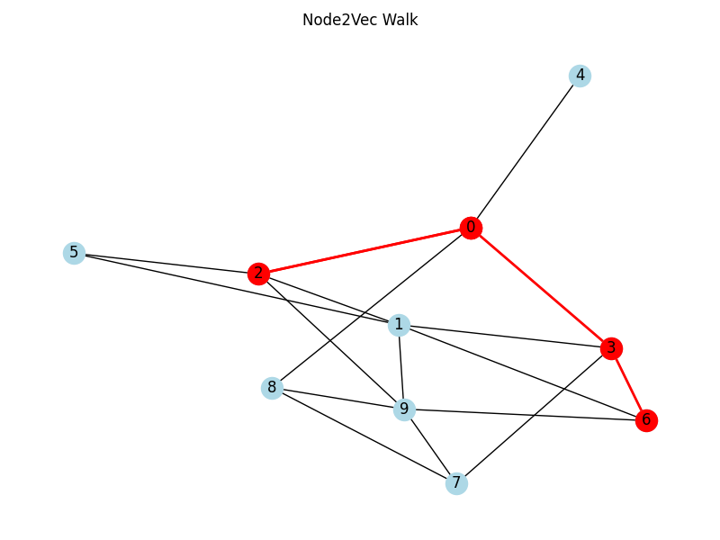

---

## From Walks to Vectors — it's just Word2Vec
- Remember Word2Vec? **Swap two words and you have Node2Vec:**
  - a **sentence** → a **random walk**
  - a **word** → a **node**
- Run many walks → a "corpus" of node-sentences → feed it to **skip-gram**.
- Out comes one **vector per node**. Same machine, graph data.

---

## Node2Vec – Skip-Gram Analogy
```
Walk:        A → B → C → D → E
Context:         [B, D]
Input:               C
```
- Input = center node (`C`)
- Context = neighboring nodes in walk window (e.g., `[B, D]`)
- Objective: Predict context nodes from input node.
- Same training idea as Word2Vec, but on graph walks instead of text.

---

# Summary / Key Takeaways

---

## Summary / Key Takeaways
- **Word2Vec** turns words into vectors by predicting each word's context (*skip-gram*); similar words get similar vectors.
- **Node2Vec is Word2Vec on graphs:** random walks are the "sentences", nodes are the "words".
- Uniform walks (DeepWalk) are foundational but limited; Node2Vec adds flexible, biased sampling via `p` and `q`.
- The resulting node embeddings turn graph structure into vectors — ready for ML on graphs.
