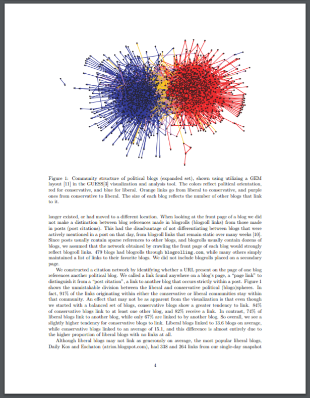
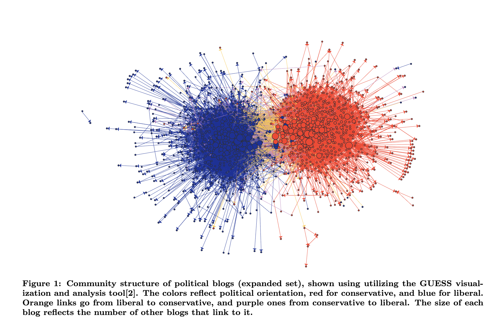
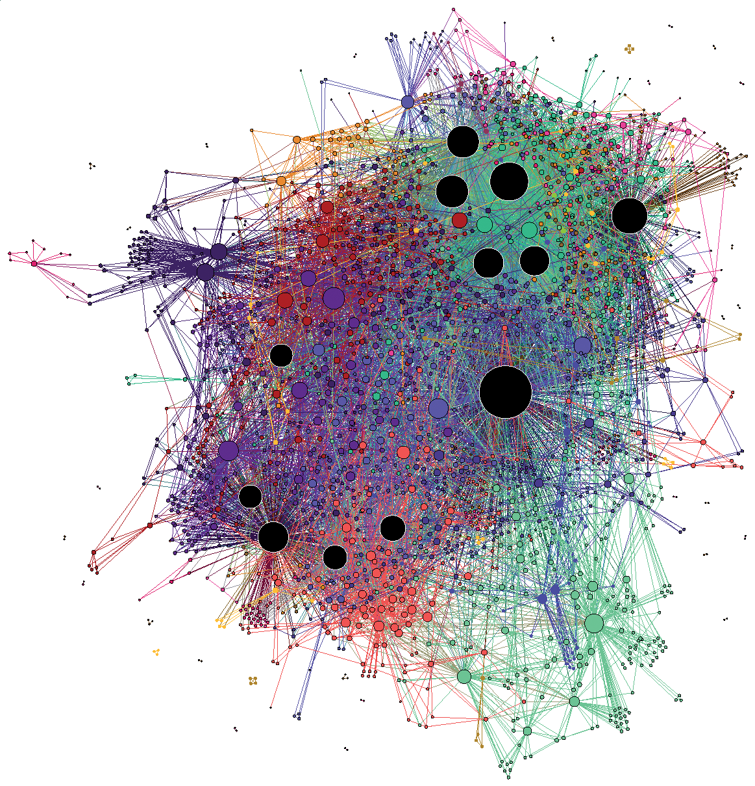
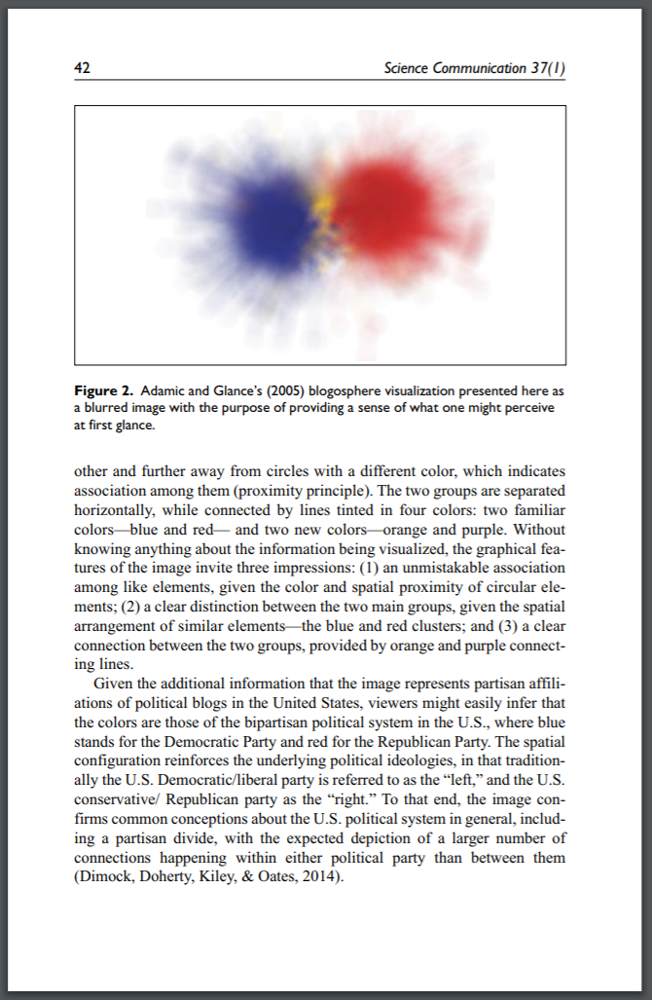
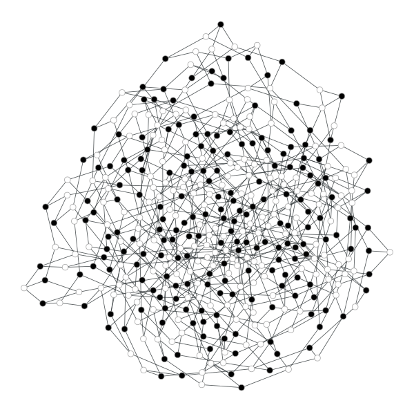
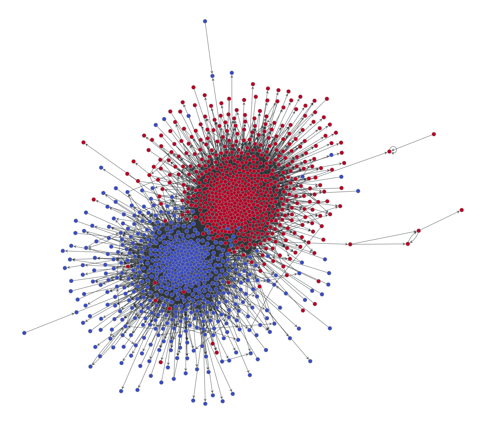
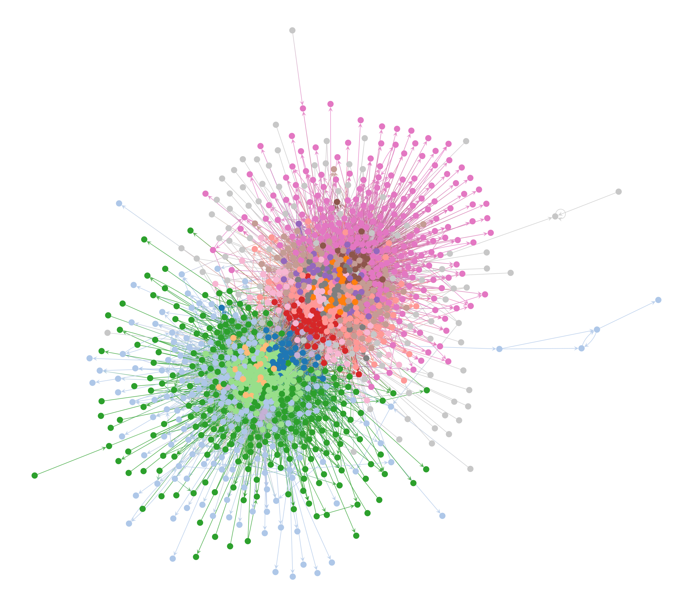
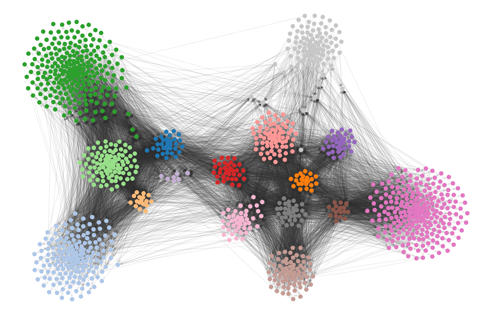
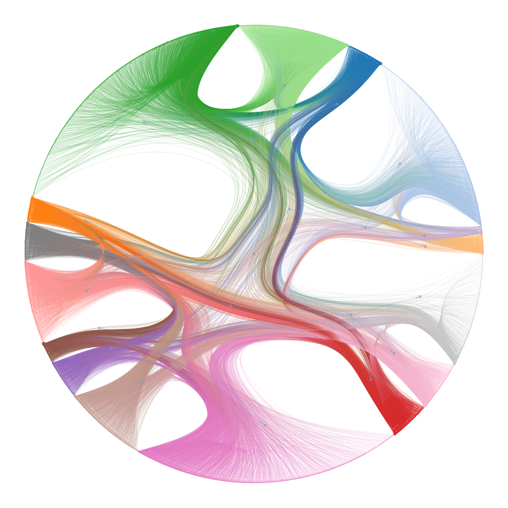

<!-- _paginate: false -->

# Beyond the Hairball

### The Myth and Reality of Network Polarization

A cautionary tale about visualization in network science

---

# Agenda

1. The Hook: the legend of *Figure 1*
2. The Clustering Illusion
3. How visuals deceive
4. What the math actually says
5. Visualization-second
6. The map is not the territory

---

# Agenda

1. **The Hook: the legend of *Figure 1*** ← next
2. The Clustering Illusion
3. How visuals deceive
4. What the math actually says
5. Visualization-second
6. The map is not the territory

---

# I. The Hook

---

## 2004. Two researchers. One election.

Lada Adamic & Natalie Glance harvest the political blogosphere
two months before Bush vs. Kerry.

> *The Political Blogosphere and the 2004 U.S. Election: Divided They Blog*

---

---

## One image. 2,500+ citations.

- Red = conservative, blue = liberal
- Two clear "echo chambers"
- An icon was born

---

## ...but it was never the evidence

The paper's conclusions came from **metrics**, not the picture.

The figure was just an illustration of methodology.

---

## Yet other authors used it as proof

> "What immediately stands out is the **extreme separation**
> between liberals and conservatives..."

— *Connected* (2009), pop-science bestseller by
Christakis & Fowler — the book that turned
*Figure 1* into mainstream evidence of echo chambers.

---

# Agenda

1. The Hook: the legend of *Figure 1*
2. **The Clustering Illusion** ← next
3. How visuals deceive
4. What the math actually says
5. Visualization-second
6. The map is not the territory

---

# II. The Clustering Illusion

---

---

---

## Apophenia

The human urge to see meaning in noise.

**Pareidolia:** faces in power sockets, faces on Mars, *clusters in graphs*.

---

## The clustering illusion

> *The tendency to see clusters in data
> that cannot be statistically justified.*

In networks, this is our default mode.

---

---

### "Ceci n'est pas un réseau."

A 2D projection of a high-dimensional object.

The map is not the territory.

---

---

## The blur test

Squint at *Figure 1*: two blobs.

Your brain erases the connecting links **automatically**.

---

# Agenda

1. The Hook: the legend of *Figure 1*
2. The Clustering Illusion
3. **How visuals deceive** ← next
4. What the math actually says
5. Visualization-second
6. The map is not the territory

---

# III. How Visuals Deceive

---

## Force-directed layouts see only one thing

**Assortativity** — like connecting to like.

Bipartite, tripartite, hierarchical patterns? *Invisible.*

---

---

### Every black node connects only to a white node

The layout has no idea. It looks like a hairball.

---

## Torturing the data

When the picture isn't polarized enough, some researchers...

- filter "weak" edges until clusters emerge
- delete moderate nodes to manufacture a chasm
- pre-set *k* = 2 and let the algorithm comply

---

## A horror story

Some papers fake the layout itself —
nodes placed randomly or in pre-separated circles —
to claim an algorithm "unveiled" what was hidden.

The visualization is the manipulation.

---

# Agenda

1. The Hook: the legend of *Figure 1*
2. The Clustering Illusion
3. How visuals deceive
4. **What the math actually says** ← next
5. Visualization-second
6. The map is not the territory

---

# IV. What the Math Says

---

## The famous 91% / 9%

> *91% of the links originating within either the conservative
> or liberal communities stay within that community.*

— Adamic & Glance, 2005

---

## 9% sounds tiny.

But community-detection algorithms predict only **~1%** would cross.

The cross-talk is **10× richer** than the math expected.

---

## Modularity ≈ 0.4

The "perfectly polarized" picture scores only 0.4.

Truly polarized networks score **above 0.9**.
(US House did, briefly, in the early 1900s.)

---

## Trust the power law, not the filter

Centrality already tells you what matters.

Don't amputate the network to make a story.

---

# Agenda

1. The Hook: the legend of *Figure 1*
2. The Clustering Illusion
3. How visuals deceive
4. What the math actually says
5. **Visualization-second** ← next
6. The map is not the territory

---

# V. Visualization-Second

---

## Flip the script

**Visualization-first** ❌
Make a picture → look for patterns

**Visualization-second** ✅
Run statistical inference → constrain the picture to it

---

### Step 1

The classic 2-color view.

What the standard layout reveals.

---

### Step 2

Same network.
**Inferred** modules via Bayesian SBM.

A force-directed layout obscures them.

---

### Step 3

Add an attractive force *between same-group nodes*.

Now the inferred structure is visible.

---

---

### Dignified ridiculogram

Hierarchical modular structure as a **chordal diagram**.

No more hairball.

---

---

### Beyond modularity

Little Rock Lake food web — nodes ranked by **trophic level**.

Force-directed layouts cannot do this.

---

# Agenda

1. The Hook: the legend of *Figure 1*
2. The Clustering Illusion
3. How visuals deceive
4. What the math actually says
5. Visualization-second
6. **The map is not the territory** ← next

---

# VI. The Map Is Not the Territory

---

## Polarization is partly a choice of lens

- Algorithm
- Threshold
- Layout
- Color palette

Different choices, different stories.

---

## The seductive futility

> If we only look for the "Divided" story,
> that is the only story we will ever see.

---

# Summary / Key Takeaways

- *Figure 1* is an icon, not evidence
- Our eyes invent clusters that aren't there
- Force-directed layouts hide most structures
- 9% cross-talk is **more** than algorithms predict
- Inference first. Picture second.

---

<!-- _paginate: false -->

# Sources

- Adamic & Glance, *Divided They Blog* (2005)
- Jacomy, *Two stories about "Divided They Blog"* — reticular.hypotheses.org/1002
- Peixoto, *Untangling the hairball using statistical inference* — skewed.de/lab/posts/hairball
- Foucault Welles & Meirelles, *Visualizing Computational Social Science* (2015)
